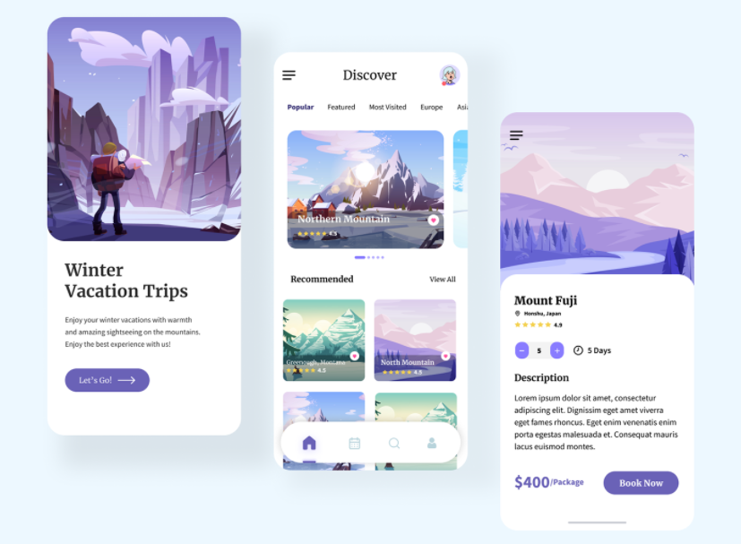
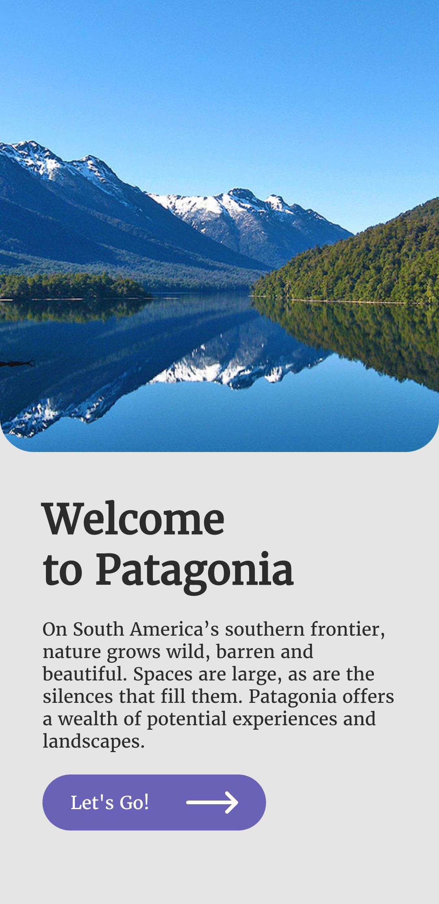
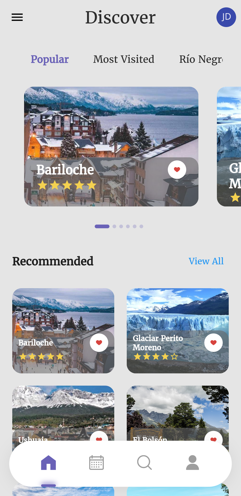
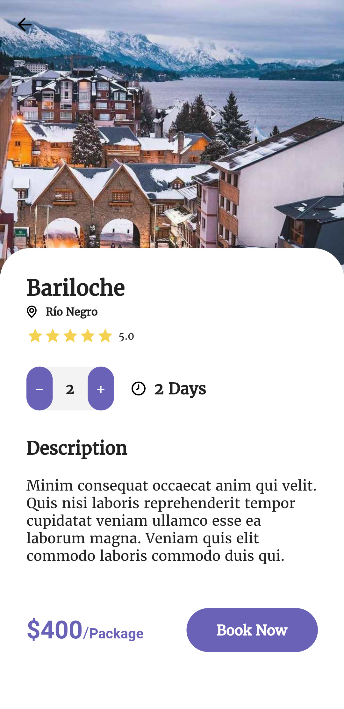

# Patagonia Travel App
 Aplicación responsive para tablet y mobile hecha en Flutter para destinos turísticos de la patagonia argentina.
 
# Getting Started
 Para instalar el proyecto se debe ejecutar el siguiente comando en la carpeta raíz del proyecto
 ```
  flutter packages get
```

# Paquetes utilizados

- <a href="https://pub.dev/packages/flutter_svg" target="_blank">flutter_svg</a>
- <a href="https://pub.dev/packages/google_fonts" target="_blank">google_fonts</a>
- <a href="https://pub.dev/packages/smooth_star_rating" target="_blank">smooth_star_rating</a>
- <a href="https://pub.dev/packages/delayed_display" target="_blank">delayed_display</a>

# Créditos del diseño
El proyecto está inspirado en el diseño de [Al Razi Siam](https://www.behance.net/gallery/111883599/Travel-App?tracking_source=search_projects_recommended%7Ctravel%20app).



# Resultado

  

